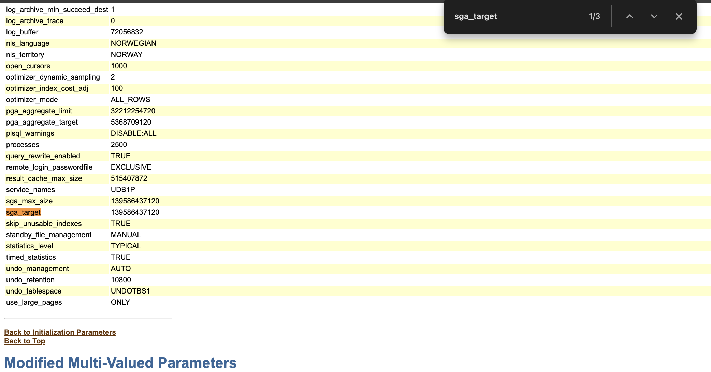
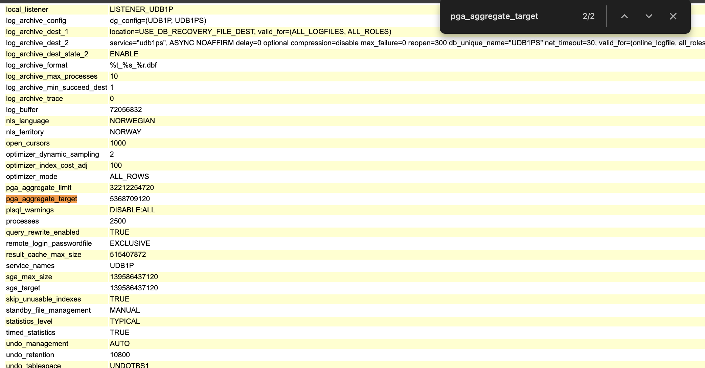
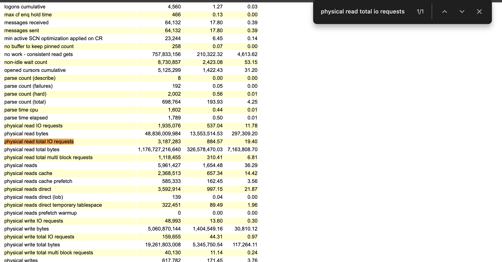
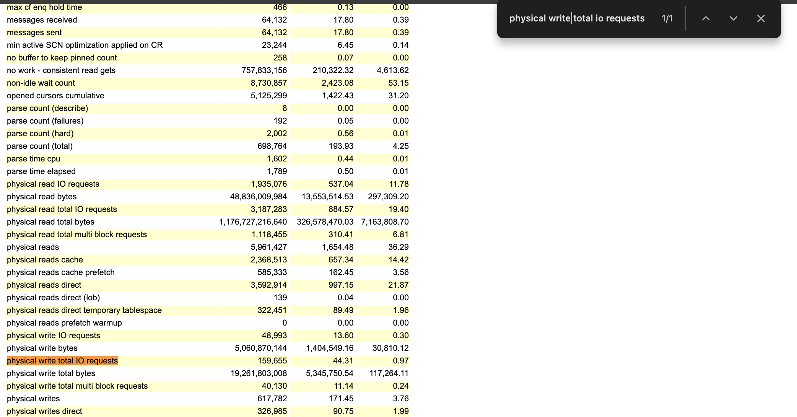
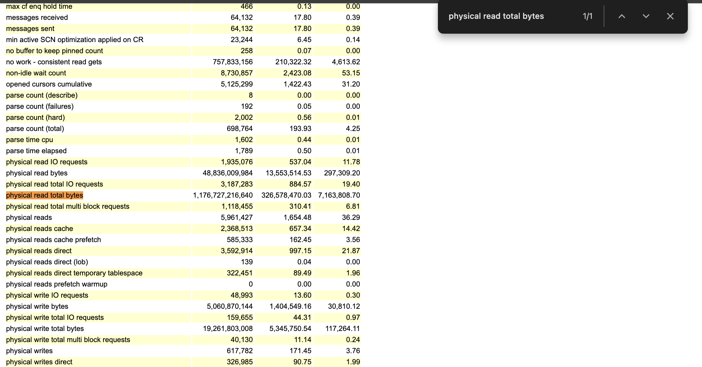
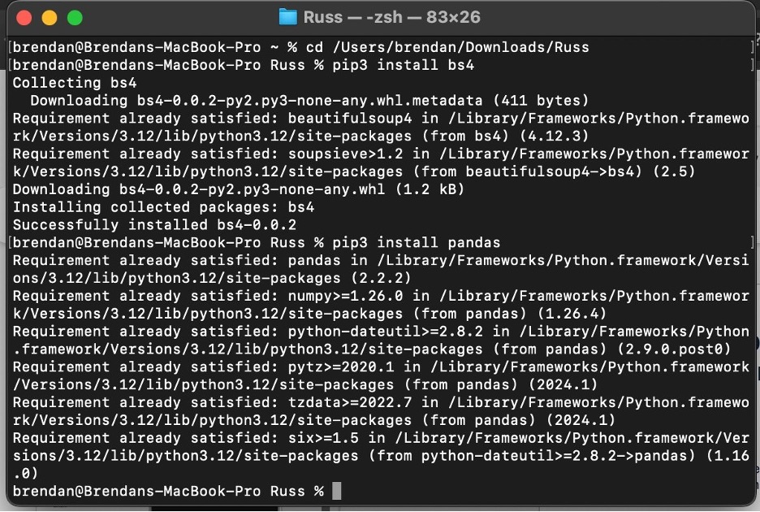
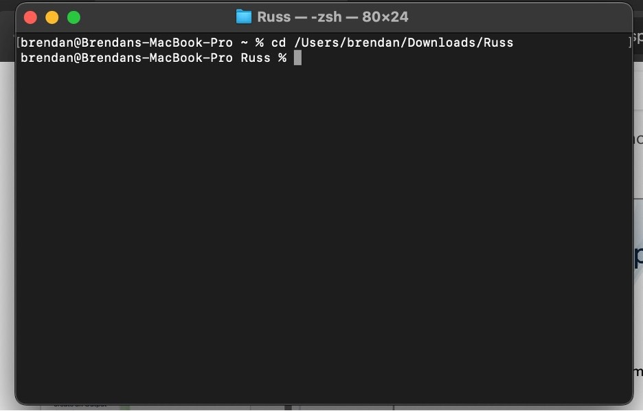
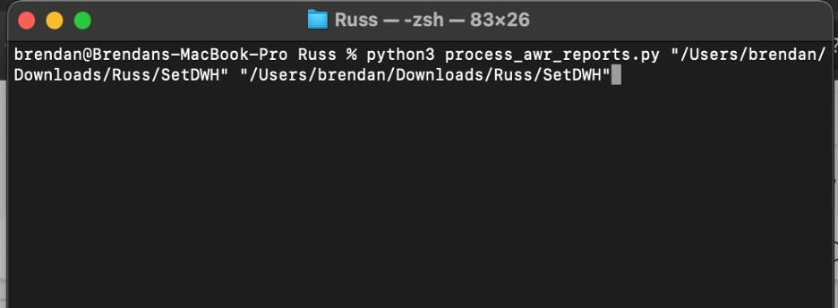
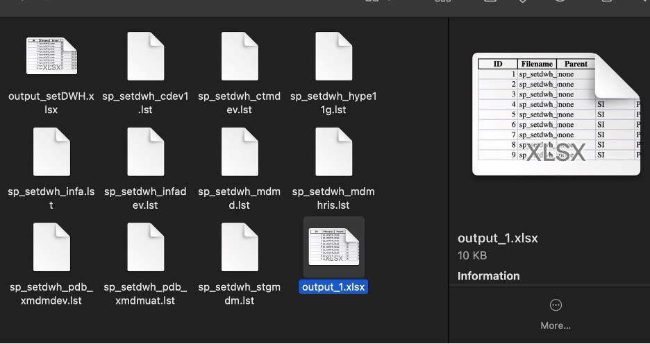

# Output Genenration
Based on the availability and the type of Document provided by the Client which is AWR Basic (.html) or AWR RAC (.html) We can create the Output File using the following two methods
## MANUAL PROCESS
In the case of Errors and unavailability of AWR's (HTML) files. There can be statspack reports or .out available following the below steps you can extract the required data from the mentioned files.

* You can create a new worksheet in the name of Opportunity_Output followed by date. Ex:(scr_output_01012025)
* Open the HTML files and search for the following values using Find (ctrl+f) function.

| KEYWORDS | VALUES TO SEARCH IN THE FIND POPUP |
| ----------- | ----------- |
| DB ID | DB ID |
| Instance | Instance |
| Version | Version |
| RAC | RAC |
| Host NAME | Host NAME |
| Platform | Platform |
| CPU | CPU |
| Cores | Cores |
| Memory | Memory |
| Begin Snap (begin time) | Begin Snap (begin time) |
| End Snap (end time) | End Snap (end time) |
| Elapsed Time(mins) | Elapsed Time(mins) |
| DB Time | DB Time |
| SGA    | Search as sga_target |
| PGA | Search as pga_aggregate_target |
| DB IO Read (IOPS) | Search as physical read total IO requests |
| DB IO Write (IOPS) | Search as physical write total IO requests |
| DB IO Read (BPS) | Search as physical read total bytes |
| DB IO Write (BPS) | Search as physical write total bytes |

**Refer to the Screenshots attached below.**

1. SGA 

2. PGA

3. DB IO READ (IOPS)

4. DB IO WRITE (IOPS)

5. DB IO READ (BPS)

6. DB IO WRITE (BPS)


## AUTOMATED PROCESS

 PREREQUISITES

 * Make sure you have Installed Python in your Device or Download in Python website.

 * Based on version you would have to install 'BS4' and 'pandas' library.

 * Install them by using these "pip install beautifulsoup4" and "pip install pandas"

 * If you are unable to use those above commands, try using "pip3" for "pip".



**Generation Process using python Script**

* Download the Python Script to process AWR Reports and Statspack reports from [Process_AWR_Reports.py](downloads/process_awr_reports.py)

* Download your HTML Files from OneDrive or obtain from Slack.

* Open the Command Prompt or PowerShell in WINDOWS or Terminal in MAC and LINUX.

* Using Command Prompt Navigate to your HTML Files Location Using "cd" command.




* Using the command below Process the HTML files.

```
python3 process_awr_reports.py "Input file path" "Output file path"
```

* Replace the "file path" to the Path of your HTML files in the command.

* Input: (supported report types and other input files): AWR Basic (.html), AWR RAC (.html)



* You can find the Output files in the folder of your AWR Reports.

* Verify whether the values are entered in their designated columns.



!!! note "POINTS TO REMEMBER"

    When there is a AWR Report for the same DATABASE with different
    Startup Times, we can choose the AWR which has the highest DB Time.
    

