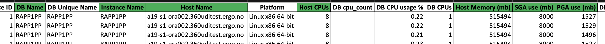
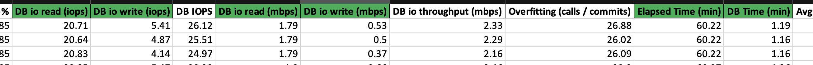
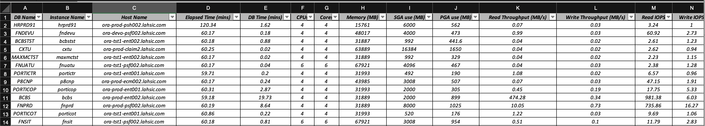
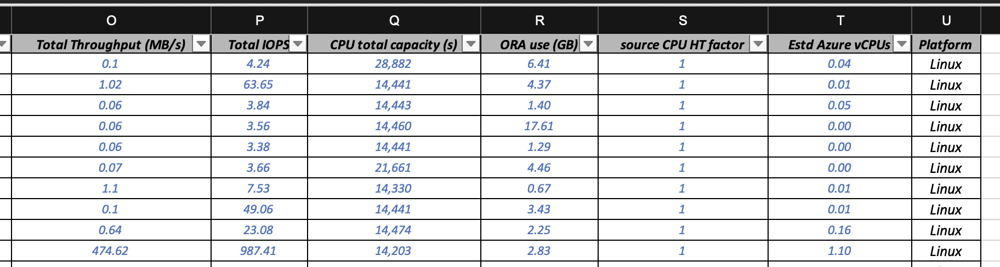
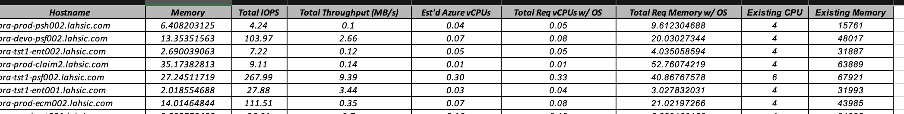
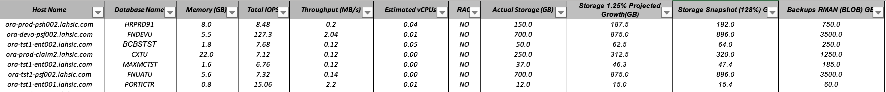
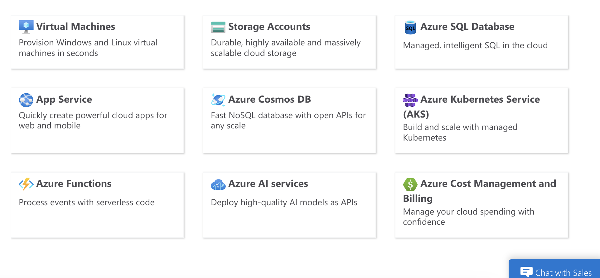
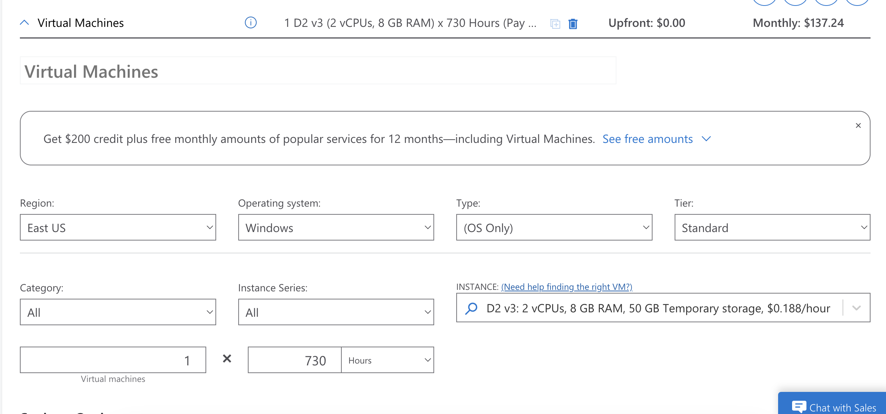
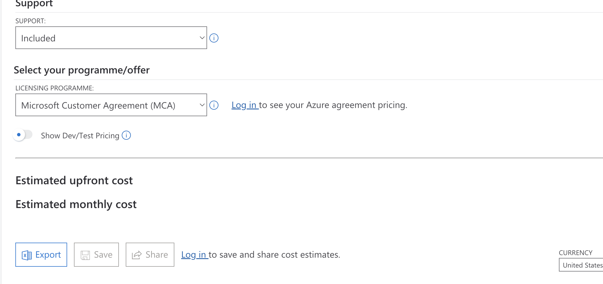

# AWR Analysis Preparation

  This document is about preparing the AWR Anlysis Report which is crucial for providing instances based on thier requirement and various possibilities to increase productivity.

## TECHNICAL DETAILS

* **DB Name**

 DB name refers to the name of the database. It is an identifier used to distinguish one database from another within a database management system (DBMS). For example, in Oracle databases, the DB name is the unique name given to a database instance.

* **Read Throughput**

 Read Throughput measures the rate at which data is read from a storage system, typically in megabytes per second (MB/s) or gigabytes per second (GB/s). It indicates the performance of read operations in a database or storage environment.

*	**Instance Name**

 Instance Name refers to the name of a specific instance of a database. A database instance is a set of memory structures and background processes that access a database. In multi-instance databases like Oracle RAC (Real Application Clusters), each instance has a unique name.

*	**Write Throughput**

 Write Throughput measures the rate at which data is written to a storage system, usually expressed in MB/s or GB/s. It indicates the performance of write operations in a database or storage environment.

*	**Host Name**

 Host Name is the name of the server or machine where the database or application is running. It is used to identify the physical or virtual machine in a network.

*	**SGA (System Global Area)**

 SGA is a shared memory area that contains data and control information for an Oracle database instance. It includes various memory components like the database buffer cache, shared pool, and redo log buffer, essential for database operations and performance.

*	**Elapsed Time**

 Elapsed Time refers to the total time taken to complete a particular task or operation, from start to finish. In database performance metrics, it can represent the time taken for a query to execute or a batch process to complete.

*	**PGA (Program Global Area)**

 PGA is a memory area that contains data and control information exclusively for a server process in Oracle databases. It is allocated when a process is started and is used for things like sort operations and session memory.

*	**DB Time**

 DB Time is the total time spent by the database server processing user requests, including CPU time and wait time. It is a key performance metric for assessing database load and efficiency.

 * **Read IOPS**

 Read IOPS (Input/Output Operations Per Second) measures the number of read operations performed by the storage system per second. It is a crucial metric for understanding the read performance of storage devices.

*	**CPU's**

 CPU's (Central Processing Units) refers to the processors in a server or machine that handle the execution of tasks. This can include the number of physical CPUs and the number of cores within each CPU.

*	**Write IOPS**

 Write IOPS measures the number of write operations performed by the storage system per second. It is a key metric for understanding the write performance of storage devices.

*	**Cores**

 Cores refer to the individual processing units within a CPU. Modern CPUs have multiple cores, allowing them to perform multiple tasks simultaneously. The number of cores is a significant factor in determining a CPU’s processing power.

*	**Memory**

 Memory refers to the physical RAM (Random Access Memory) available in a system. It is used to store data temporarily for quick access by the CPU. More memory allows for better performance, especially for applications and databases that require large amounts of data to be processed quickly.

*	**Total Throughput**

 Total throughput refers to the total amount of data processed by a system or network in a given period of time. It is often measured in terms of data transfer rate, such as megabytes per second (MB/s) or gigabits per second (Gbps). Throughput is a critical metric for assessing the performance of storage systems, networks, and databases, indicating how efficiently data is being handled.

*	**Total IOPS (Input/Output Operations Per Second)**

 Total IOPS measures the number of input/output operations a storage system can handle per second. It is a key performance indicator for storage devices like SSDs, HDDs, and SANs, especially in environments with high transaction rates. Higher IOPS indicates better performance, as it means the storage system can handle more read/write operations in a given time frame.

*	**CPU’s Total Capacity**

 CPU’s total capacity refers to the total processing power of a CPU, typically measured in gigahertz (GHz) and core count. It can be described as the cumulative computational ability of all the cores in a CPU, determining how many tasks it can handle simultaneously and how fast it can process data. Factors like clock speed, number of cores, and architectural efficiency contribute to the total capacity of a CPU.

*	**ORA Use**

 ORA use likely refers to Oracle database usage. In a database context, ORA (short for Oracle) is used to indicate metrics or statistics related to the utilization and performance of an Oracle database system. This can include various aspects like CPU usage, memory usage, disk I/O, and database transactions, helping administrators optimize and monitor the database’s performance.

*	**Source CPU’s HT Factor**

 Source CPU’s HT (Hyper-Threading) factor refers to the use of Intel’s Hyper-Threading Technology in the source CPU. Hyper-Threading allows a single physical processor core to behave like two logical cores, enabling better utilization of the CPU resources and improving parallelism. The HT factor indicates whether Hyper-Threading is enabled and to what extent it enhances the CPU’s ability to handle concurrent threads.

*	**Estimated AZURE vCPU**

 Estimated Azure vCPU refers to the virtual CPU equivalent in Microsoft Azure’s cloud computing environment. A vCPU (virtual CPU) is a unit of computational resource in Azure's virtual machines. Estimating Azure vCPUs involves determining the number of virtual CPUs needed based on the workload requirements, often by translating physical CPU cores from on-premises systems to Azure's virtual environment. This estimation helps in planning and migrating workloads to Azure, ensuring adequate performance and resource allocation.

### SUMMARY
    
By Default these are the sheets which are available in the Analysis Template.

* AWR data
* Host wise analysis
* Database analysis
* Placements
* Cost
* Multiple factor

### AWR DATA

| **Manual Input** | **Automatically detected** | 
| ----------- | ----------- |
| DB name | Total throughput |
| Read Throughput | Total IOPS |
| Instance Name | CPU’s total capacity |
| Write Throughput | ORA use |
| CPU | Source CPU’s HT factor |
| Cores | Estimated AZURE vCPU |
| Memory |  |
| Host NAME |  |
| Elapsed Time(mins) |  |
| DB Time |  |
| SGA |  |
| PGA |  |
| DB IO Read (IOPS) |  |
| DB IO Write (IOPS) |  |
| DB IO Read (BPS) |  |
| DB IO Write (BPS) |  |

**Refer to the screenshots attached below**

**1. Values to enter from the Output File**

**2. Manually entered data in the AWR Data sheet.**

**3. Automatically detected values.**

!!! note "Formulas used in AWR DATA sheet to detect data"

    Total throughput (read throughput + write throughput)

    Total IPOS = (read IPOS + write IOPS)

    CPU total capacity = (Elapsed time * 60 * CPUs)

    ORA use = (SGA+PGA/1024)

    Source CPU HT factor = (CPUs / cores)

    Est azure vCPUs = Elapsed time + DB Time * ('Multiplier Factors'!$C$4 * 'Multiplier Factors'!$C$2 * 'Multiplier Factors'!C$8)/S3

### HOSTWISE ANALYSIS

Host wise analysis will be automatically populated with the data provided in the AWR data sheet when the Existing Hostnames are entered in the designated Coloumn. If in case the data is not detected automatically it can also be entered manually.

These are the data’s which will be available in the hostwise analysis.

* Host
* Memory
* Total throughput 
* Total IOPS
* Est’d azure vCPUs’
* Total Req vCPUs w/OS
* Total Req Memory w/OS
* Existing CPU
* Existing Memory

**Refer to Screenshots attached**

### DATABASE ANALYSIS

Same as the Hostwise Analysis sheet the required data will populated automatically once the DB Name is entered in the designated Coloumn. But there are three exemptions which will not be auto populated.

1. RAC - Verify with the AWR's or any info shared by the client and Populate manually
2. ACTUAL STORAGE - Storage details for the Database will not be available in the AWR's, gather them from the dbspace.lst files or other files shared by the client. In the case of Storage details not available assume as **1 TB**.
3. ENVIRONMENT - Verify with .xls or any other files which can help in determining the Environments.

These are the data’s which will be available in Database Analysis Sheet.

* Database name 
* Memory
* Total IOPS
* Total throughput
* Estimated vCPU
* RAC
* Actual storage
* Storage 1.25% (Projected growth)
* Storage snapshot (128%)
* Backups RMAN (BLOB)
* DB type

**Refer to the Screenshot attached**

!!! note "Formulas used in DATABASE ANALYSIS sheet to get storage details"

    Storage 1.25% (Projected growth) = (1.25*actual storage) 
    Storage snapshot (128%) = (1.28*actual storage)
    Backups RMAN (BLOB) = (5*actual storage)

### PLACEMENTS AND PRICING

The document will help us to learn about 

* Selecting VM's on Azure based on the VCPU and Memory requirement.
* Azure pricing calculator and exporting the pricing details.
* We will learn about the formula of Calculating a 3-year reserved instance in the Azure pricing calculator.

**STEPS INVOLVED:**

* Follow the link provided below to land on Azure pricing calculator website.

    [AZURE PRICING CALCULATOR](https://azure.microsoft.com/en-in/pricing/calculator/)

* Add neccesary products required from the available services. Usally in our usecase we use Virtual Machines and Storage Accounts.

* Scroll down to access the products chosen and choose from the various options provided.

   1. Choose the region based on the requested or by default East US.
   2. Select the Operating System for the VM from either Windows or Linux based on the ask.
   3. Choose the Instance required based on the Data gathered in the DATABASE ANALYSIS SHEET. For detailed view of Throughputs and IOPS of the VM's use this external website. [Cloud Price](https://cloudprice.net/)
   4. Select pay as you go and save the VM config.
   5. Copy the configured pricing link and paste it on the COST SHEET in your AWR Analysis.

**Pricing Export :**

In order to calculate the 3yr RI cost and to prepare Proposals we have to download the configured service using the Export icon.

??? info "Points to Remember"

    1.	We cannot assign TWO VM’s for the Same Instance in the case of RAC Database.

    2.	Always Go for E-Series and M-Series. DS-Series is costly compared to the E and M series.

    3.	_v5 is a better option compared to the _v3

    4.	For Linux the fixed vCPU factor is 2.

    5.	We can reduce the RAM factor to 1.25 if the AWR data is only for 9 hours.

    6.	1 VM can host only same major version databases

    7.	Payment and non-payment databases cannot be on same host

    8.	Mv1 series should be taken into account only if E series and Mv3 series doesn’t suffice as Mv1 series uses old gen CPUs.

    9.	AIX Based Systems use the same Multiplier factors as SOLARIS with 8 as vCPU HT Factor.

    10.	In the case of throughput High Data Points . Go for a suggestion from Senior Engineers.

    11.	It is not necessary to go with the One on One sizing in the case of placements in IAAS, the best possible Way is preferable.

    12.	In the case of %DB Time is less than 70-75%, we can alter the formula by multiplying the Estd. VCPUs by %DB Time/100.

