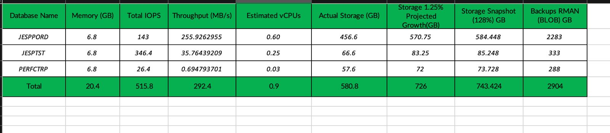

# PROPOSAL CREATION

## INTRODUCTION:

This document will help us create Propsal Deck for the AWR Analysis using Templates and Pricing Export.

In the Proposal Deck we need update the following slides as the remaining slides serve as a template.

* Find the required sources and update them in a workout.xls file before updating in the Proposal itself.

| **Source** | **Target (Slide no)** | **Slide Title** |
| ------------ | ------------- | ------------ |
| AWR Analysis File | 04  | AWR Analysis |
| AWR Analysis File | 07  | IAAS Workload Mapping |
| AWR Analysis File | 12  | PAAS Workload Mapping |
| Costing Link | 08  | IAAS - PRICING |
| Costing Link | 13  | PAAS - PRICING |
| Proposal Template | 19  | PRICING SUMMARY |

**WORKOUT FILE**

Generate an Excel file named 'client name_workout', where 'client name' refers to the specific client. For example, if our client is Commure, the Excel file should be named 'commure_workout'.

* Enter ther values from the Source Files to this Workout File before entering them in Proposal Deck

* We use this step to prevent error in Deck and also more flexibility editing in the Excel files.

* Costing Link provides us the Pricing Export File in Worksheet format.

### POPULATING SLIDES FROM THE SOURCE

#### Slide no 4 - AWR Analysis

In the AWR Analysis (slide no 4) we need populate the data we gathered from the Analysis - DATABASE ANALYSIS Sheet.

* Follow the template given and populate the required coloumns accordingly.

* Remember to Format the slide using the specifications mentioned in SOURCE FORMATTING.

**Refer to the screenshots attached below**

1. Copying data from DATABASE ANALYSIS Sheet to Workout File

2. Moving the edited AWR Analysis template to Slide no 4.

#### Slide no 7 - IAAS WORKLOAD MAPPING

* In Slide no 7 we need to Show the designated VM's to thier respective Databases on One:One mapping(IAAS)

* The data should be retrieved from the Placement sheet from the AWR Analysis file.

* The goal of IAAS workload mapping is to optimize the use of cloud infrastructure to meet the specific needs of various applications and services, ensuring performance, reliability, and cost efficiency.

**Refer to the screenshots attached below**

1. Copying data from PLACEMENTS Sheet to Workout File

2. Moving the edited IAAS Workload template to the Slide no 7

#### Slide no 12 - PAAS WORKLOAD MAPPING

* In Slide no 12 we need to Show the designated VM's to the Consolidated Datasbase based on thier Environment, DB Version, etc..

* The goal of PAAS workload mapping is to efficiently utilize the platform's capabilities to meet the specific needs of various applications and services, ensuring they run smoothly, cost-effectively, and securely within the PAAS environment.

* This data will be retrieved from the PLACEMENT Sheet under the heading PAAS.

**Refer to the screenshots attached below**

1. Copying data from PLACEMENTS Sheet to Workout File

2. Moving the edited PAAS Workload template to the Slide no 12

#### Slide no 8 - IAAS PRICING

* IAAS Pricing template will be generated based on the link provided in the cost sheet. We can utilize the template to populate the IAAS pricing PPT sheet.

* Follow the link provided in the cost sheet to navigate directly to the corresponding page. Once there, click on the 'Export' option to download the Excel sheet. 

* Apply the values from this Pricing Export Sheet to the Template in Workout File to automatically calculate the Microsoft Azure 3 yr RI Pricing.

!!! note "Formula to Calculate 3 yr RI"

    Reserved percentile = { (100 - 3yr RI % ) / 100 + 1 }

    Monthly cost of 3yr RI = PayG * Reserved Percentile - PayG

**Refer to the screenshots attached below**

1. Copying data from PRICING EXPORT Sheet to Workout File

    
2. Moving the edited IAAS PRICING template to the Slide no 8

#### Slide no 13 - PAAS PRICING

* PAAS Pricing template will be generated based on the link provided in the cost sheet. We can utilize the template to populate the PAAS pricing Slide.

* Follow the link provided in the cost sheet to navigate directly to the corresponding page. Once there, click on the 'Export' option to download the Excel sheet. 

* Apply the values from this Pricing Export Sheet to the Template in Workout File to automatically calculate the Microsoft Azure 3 yr RI Pricing.

**Refer to the screenshots attached below**

!!! note "PAAS Key Notes"

    In the case of HA/DR recomendation mention the respective VM's and Storage accounts as HA in the (Summary of BOM) coloumn.

1. Copying data from PRICING EXPORT Sheet to Workout File

    
2. Moving the edited IAAS PRICING template to the Slide no 8

#### Slide no 19 - PRICING SUMMARY

* Gather the Monthly PayG and 3 yr RI cost for IAAS and PAAS

* Populate the data using the template PRICING SUMMARY in the Worksheet.

* This slide displays the Pricing comparison between IAAS and PAAS

**Refer to the screenshots attached below**

1. Copying data from IAAS PRICING AND PAAS PRICING Sheet to PRICING SUMMARY both in Workout File

    
2. Moving the edited PRICING SUMMARY template to the Slide no 19

##### LICENSING

 For the purposes of licensing Oracle programs in an Authorized Cloud Environment, customers are
required to count the maximum vCPUs of an instance type as follows:

* Amazon EC2 and RDS - count two vCPUs as equivalent to one Oracle Processor license if
multi-threading of processor cores is enabled, and one vCPU as equivalent to one Oracle
Processor license if multi-threading of processor cores is not enabled.

* Microsoft Azure – count two vCPUs as equivalent to one Oracle Processor license if multithreading of processor cores is enabled, and one vCPU as equivalent to one Oracle Processor license if multi-threading of processor cores is not enabled.

* Google Cloud Platform - count two vCPUs as equivalent to one Oracle Processor license if
multi-threading of processor cores is enabled, and one vCPU as equivalent to one Oracle
Processor license if multi-threading of processor cores is not enabled. 

Learn more on [ORACLE LICENSING](https://www.oracle.com/a/ocom/docs/cloud-licensing-070579.pdf)

* For IAAS to calculate the Oracle license required we need to calculate the Total no VCPU's divided by 2. (Total VCPU's / 2)

* For PAAS to calculate the Oracle license required we need to calculate the Total no VCPU's for both Primary and HA divided by 2. (Primary VCPU's + HA VCPU'S / 2)

### SOURCE FORMATTING

Source formatting in a PowerPoint presentation refers to the way in which you cite and present information from sources within your slides. This ensures that you give proper credit to the original authors and maintain academic integrity. 

Key aspects of source formatting in PowerPoint presentations include:

On the homepage:

* Choose the font style "Lato"
* Set the font size to 11
* Make the font color white
* Fill shapes with green color

Navigate to the table design page:

* Set the pen color to white
* Apply borders to all sides of the table

!!! note "Formula to Calculate 3 yr RI"

    1.	We need to show 2 options for the PaaS :

    Option 1 : As-is single VM , Single AZ config and Pricing (leave it as-is)

    Option 2: With HA - Add a HA mapping slide and add a pricing slide with HA

    For all pricing slides, add a ROW at the bottom to show Tessell pricing (leave the Tessell pricing blank, Higher rankings will add it)
    

